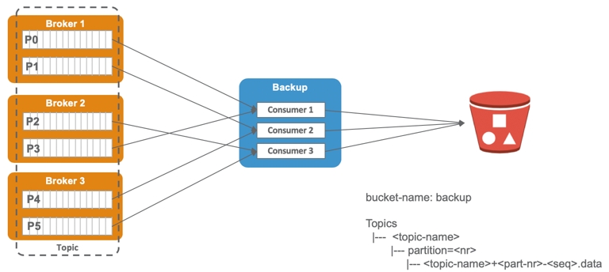
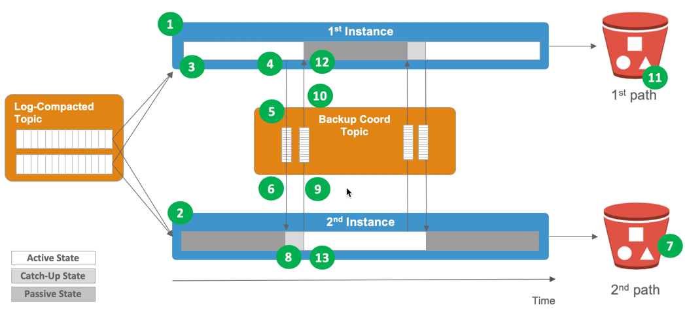
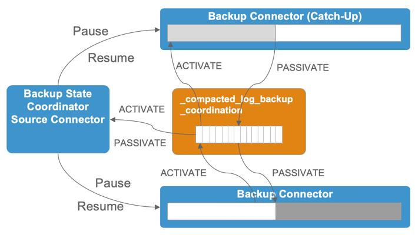
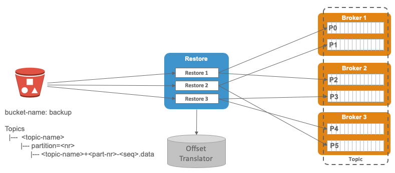

# Backup

The backup can be started on a topic base and will consume all the partitions of the topic to be backed-up and write it to a bucket in object storage. The following diagram shows the schematics of the Backup solution:



We will also backup some of the internal topics

* `__consumer_offsets` - this is the topic where the consumer commits its offsets by default. We have to backup this topic not really to be able to restore it, but to be able to do the offset translation upon restore. The backup is needed because a deletion of a "normal" topic through Kafka Admin will write a record with a NULL value to this topic, which will remove the offsets for that topic upon the next compaction cycle ([Issue 15](https://github.com/TrivadisPF/kafka-backup/issues/15))
* `_schemas` -

## Serialisation

Each record from Kafka is written to the Backup serialised as an Avro Record in the following format:

```
{
    "namespace": "ch.tbd.kafka.backuprestore.model.avro",
    "type": "record",
    "name": "AvroKafkaRecord",
    "fields" : [
        {"name": "topic", "type": "string"},
        {"name": "partition", "type": "int"},
        {"name": "offset", "type": "long"},
        {"name": "timestamp", "type": "long"},
        {"name": "key", "type": [ "bytes", "null" ], "default": "null" },
        {"name": "value", "type": "bytes"},
        {"name": "headers", "type": [ {"type": "map", "values": "bytes"}, "null" ], "default": null}
    ]
}
```

We decided to use Avro because it will simplify serialisation, as it will all be done by Avro. We can also assume that we can easily guarantee that the data can be restored later, even if in the future we would for some reason decide to change the backup record.

The data in the Avro object contains the following information. When we talk about original Kafka record we mean the Kafka record which as been consumed by the backup process and is being backed up to Object storage.

* `topic` - the topic this backed-up Avro record belongs to
* `partition` - the partition of the topic this backed-up Avro record belongs to
* `offset` - the offset of record in the original topic
* `timestamp` - the value of the timestamp from the original Kafka record.
* `key` - the content of the key from the original Kafka record as a sequence of 8-bit unsigned bytes
* `value` - the content of the value from the original Kafka record as a sequence of 8-bit unsigned bytes
* `headers` - all the headers from the original Kafka record as a Map. The key of the map is a string (which is the name of the header) and the maps value is serialized as a sequence of 8-bit unsigned bytes

## Organisation in Object Storage

The data has to be partitioned in Object Storage in a way that the original partitioning from the topic is preserved.

```
topics
|--- <topic-name>
     |--- partition=<nr>
          |--- <topic-name>+<part-nr>-<seq>.data
```


## Data Retention on Backup

The data in the backup should not be kept much longer than the data-retention on the Kafka topic. If the Kafka topic is

### Time-based Retention

Time-based retention removes "old" data based on the timestamp of a non-active segment (Kafka log file). Active segments are never checked for removal. If a segment is not closed before the data retention is over, the data will be kept longer than the data retention.

**Idea:** When we write the buckets, we set the metadata of the last message written.

With the backup we guarantee that the backup holds data as long as the data retention on the Kafka topic.
### Size-based Retention

Size-based retention removes "old" data based on size of the topic.

The size-based retention **is currently not supported** by the Kafka backup. It will later be added.

### Compacted Log Topics

If a topic is a so-called "compacted log" topic, then data is deleted based on keys so that only the latest info per key is kept.

In such a case we cannot remove data in the same way as for the size- and time-based topics.

[Issue #30](https://github.com/TrivadisPF/kafka-backup/issues/30) describes two possible issues we discussed. In here only the final solution is documented.

The idea of the backup of compacted log topics is that a backup is always starting from offset 0 and backups all the data into S3. Conceptually we will use an **Active/Passive** setup. There are always to identical instances ready for doing a backup, one in **Active** and one in **Passive** mode. In order to keep the size of the backup small, after some time, the active backup instance informs the one in passive state that is should take over the work. The passive instance will start its backup (again from offset 0) and as soon as it reaches the end of the topic, it will switch to **active state** and inform the previous active one to change itself to passive state. Upon changing to passive state, the instance will remove its backup data on S3.  

The following diagram shows the two backup instances running for a Log Compacted Topics.



The following steps describe one cycle of the backup and the switch from **Active** to **Passive**

 1. one instance starts in **Active** (white background)
 2. and one instance starts in **Passive** state (grey background)
 3. the active instance starts its backup from offset 0
 4. the backup runs until a configurable time has passed (`compacted.log.backup.length.days`)
 5. the active instance publishes a message to topic `_compacted_log_backup_coordination` according to this [Avro Schema](../src/main/avro/AvroCompatedLogBackupCoordination-v1.0.avsc)
 6. the Passive instance picks up the message and changes its state to **Catch-up**
 7. clears its backup destination on S3
 8. and (re)starts its own backup from offset 0
 9. if the passive instance is at the end of the topic, it sends another message to `_compacted_log_backup_coordination`, this time to inform the Active instance to switch into **Passive** state
 10. The Active instance consumes the message
 11. clear its backup destination on S3
 12. and changes its state to **Passive**
 13. the Passive instances changes its state to **Active** while continuing backing up the data

Now the circle restarts with the roles (**Active** and **Passive**) switched.

The following diagram shows the usage of the coordination topic in more detail.


In order to keep the solution simple at the beginning, we could always start twpo instances of backup with identical configuration, except that one would start-up in **Passive** and one in **Active** state.

Option questions and possible solutions

  1. What does **Active** and **Passive** mode mean in the context of a Kafka Connector?

     * we could use the **Pause** and **Resume** commands of a connector to match **Passive** and **Active** modes. A connector which is paused will no longer receive messages from the Connector. There are two corresponding methods `pause` and `resume` on the `SinkTaskContext` class (an instance of this class being available inside the connector)
  2. How to start a backup from the beginning, if a connector was already running

     * use the [`offset`](http://raovat2.champhay.com/apache/kafka/2.2.1/javadoc/org/apache/kafka/connect/sink/SinkTaskContext.html#offset-java.util.Map) method on the `SinkTaskContext` class before switching the connector back to **Active**

  3. Is a connector in **Passive** state able to consume a message from Kafka, assuming that the connector instance has been **Paused**?

     * if this is not possible, then an option would be to implement a special Kafka Source Connector, which just reads the topic  `_compacted_log_backup_coordination` as well and executes the **Pause** and **Resume** command accordingly.

 		

  4. How do we know that we are at the end of the Topic, when we are "catching-up" in order to get the **Active** instance?

     * currently the only option I see is to also consume the `__consumer_offsets` topic and filter for the connector consumer instance which is currently active. This is shown in the diagram above as well.


# Restore


